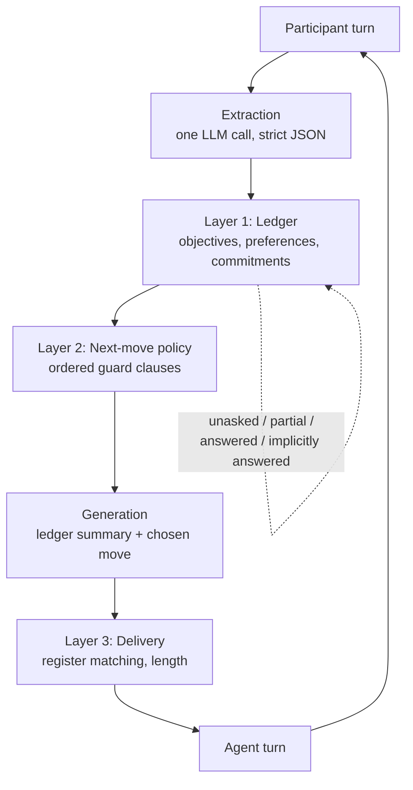

# natural-conversation-agents

Companion code for my meetup talk, **How to Make Agents Talk Like Humans**.

Most agents sound robotic for an architectural reason, not a prompting reason.

They have no model of what the conversation already covered. So they re-ask questions you
already answered, they steamroll the tangent that was about to be the best quote in the
transcript, and they acknowledge nothing you said.

I kept trying to fix that with better prompts. It never held past turn 4.

What actually fixed it was two small layers in front of generation: a ledger of what the
conversation has covered, and a policy that picks one move per turn. This repo is that,
plus a side-by-side demo of a naive question-loop agent against the ledger agent, both
facing the identical scripted participant.

It runs offline. No API key, no agent framework, ~1,400 lines.

## The numbers

Ten turns, same participant, same model, same history in both prompts.

| | naive | ledger |
|---|---|---|
| repeat-question rate | 33.3% (2/6) | 0% (0/6) |
| implicit-answer capture | 0% (0/2) | 100% (2/2) |
| acknowledgment rate | 0% (0/10) | 80% (8/10) |

Counting rules are below and printed by the harness. Read them before you believe the bars.

## Quickstart

```bash
python demo/run_demo.py --mode stub                   # side-by-side transcript
python demo/run_demo.py --mode stub --pause-at-moment # stops at the pause moment
python demo/harness.py --mode stub                    # writes artifacts/, prints the metrics
python demo/harness.py --mode live --out artifacts/live   # same, against the real model
python -m pytest                                      # 20 tests, no network
```

`python -m demo.run_demo` works too.

`rich` and `matplotlib` are optional (`pip install -e ".[demo]"`). Without `rich` the demo
prints plain text. Without `matplotlib` it skips the chart. Everything else is stdlib.

Live mode swaps the deterministic stubs for real model calls:

```bash
pip install -e ".[live]"
export ANTHROPIC_API_KEY=...
python demo/run_demo.py --mode live
```

## What live mode actually produced

I ran it. 50 calls on `claude-opus-5`, three minutes. The numbers move, and not all of them in my favour:

| | naive | ledger |
|---|---|---|
| repeat-question rate | 33.3% (2/6) | 0% (0/2) |
| implicit-answer capture | 0% (0/2) | 100% (2/2) |
| acknowledgment rate (LLM-judged) | 70% (7/10) | 90% (9/10) |
| coverage efficiency | 1.00 (6 questions / 6 objectives) | 0.33 (2 questions / 6 objectives) |

Two things to be honest about.

String matching scored the naive agent at 10% acknowledgment. An LLM judge scores the same
ten turns at 70%. The old metric was measuring vocabulary overlap, not acknowledgment, and it
was flattering the ledger agent by about sixty points. That is why live mode judges this one
with a model. The acknowledgment claim is the weakest of the three.

The ledger agent's repeat denominator collapses live, from 6 to 2. Live extraction is generous
with preferences, so more turns read as notable, so the agent acknowledges and deepens instead
of asking. "Zero repeats out of two questions" is a thinner claim than zero out of six, and the
chart does not show denominators. Coverage efficiency of 0.33 is the same fact in better
clothes: it covered six objectives on two questions because the participant volunteered the
rest.

Repeat rate and implicit-answer capture still separate cleanly. Those are the two I would put
on a slide.

## The framework



**Layer 1, the ledger** (`src/ledger.py`). Coverage state per objective, stated preferences,
and a queue of commitments the agent made to itself.

The update rule is 12 lines. The line that matters promotes an objective to
`IMPLICITLY_ANSWERED` when the participant answered it while talking about something else.
That one transition is most of the difference in the table above.

**Layer 2, the policy** (`src/policy.py`). `next_move(ledger) -> Decision`, written as ordered
guard clauses. The order is the etiquette:

1. a scheduled return is due, so `RETURN_TO_OBJECTIVE`
2. the last turn was a valuable digression, so `ALLOW_DIGRESSION` and schedule the return
3. the last turn was ambiguous, so `CLARIFY`
4. the next objective is already covered, so `SKIP_ANSWERED` and advance
5. the participant volunteered something notable, so `ACKNOWLEDGE_AND_DEEPEN`
6. otherwise `ASK_OBJECTIVE`, the next unasked one

I wrote it as guards and not nested ifs on purpose. When the agent does something rude you
read six lines top to bottom and find the guard that fired.

(The talk lists six moves. `ASK_OBJECTIVE` is the seventh, the plain default branch 6 needs.
`CLOSE_TOPIC` fires when the list runs out.)

**Layer 3, delivery** (`src/delivery.py`). Thin on purpose. Match the participant's register,
cap the length. Four-word answer in, short answer out.

## The metrics, and how they are counted

Numbers without counting rules are decoration.

| Metric | Counting rule |
| --- | --- |
| Repeat-question rate | An agent turn counts as a repeat if it asks about an objective that the participant had already answered, explicitly or implicitly, in an earlier turn; the denominator is every agent turn that asks about a specific objective. |
| Implicit-answer capture rate | An implicitly answered objective counts as captured if the agent never asked about it again after the turn that answered it sideways; the denominator is every objective the participant answered without being asked. |
| Acknowledgment rate | An agent turn counts as an acknowledgment if it references a fact or preference the participant stated in an earlier turn, judged by verbatim topic-phrase match in stub mode and by an LLM judge in live mode; the denominator is every agent turn. |
| Coverage efficiency | Questions asked is every agent turn that asks about a specific objective, and objectives covered is every objective the participant answered by the end of the conversation; fewer questions for the same coverage is the point. |

These sentences are printed verbatim by `python demo/harness.py` and stored in
`artifacts/metrics.json`. No metric value is hardcoded anywhere. They are computed from the
transcript the run produced plus the ground-truth annotations on the participant script.

## Artifacts

Both runs are checked in, so you can read them without cloning: `artifacts/` is the
deterministic stub run, `artifacts/live/` is the real one against `claude-opus-5`.
`python demo/harness.py --mode stub` regenerates the first, and
`python demo/harness.py --mode live --out artifacts/live` the second.

Each directory holds:

- `transcript_naive.md`, `transcript_ledger.md`, full runs with failure-mode callouts inline.
  `GOLDFISH` when the agent re-asks something already covered. `DEAF INTERVIEWER` when it
  ignores a turn where the participant volunteered something. In the stub run the naive agent
  commits both, at `a4`, `a5` and `a6`. The ledger agent commits neither.
- `pause_moment.md`, the pause-moment participant turn and both agents' actual next responses,
  formatted to paste straight into the deck.
- `metrics.json`, counts, rates and the counting rules.
- `metrics_chart.png`, three metric pairs, light background, one accent colour, direct-labeled bars.

## The pause moment

Turn 3 is the whole talk in one turn. The participant answers the frustration question,
answers a question I had not asked yet, and volunteers a preference on the way past.

> The delivery estimates. It says twenty-five minutes and then it's fifty, and there's no
> update in between. I only ever order dinner anyway, or lunch on weekends, so a late dinner
> is the whole evening gone. And honestly I never order breakfast. I hate morning
> notifications. The app pings me at 8am about pancakes and I want to throw my phone.

Naive agent, next turn:

> Got it, thanks. How do you decide what to order?

Ledger agent, next turn:

> Hold on, two things there. You just told me which meals you order for without me asking,
> and you clearly can't stand morning notifications. What would have to change about morning
> notifications for it to be worth opening?

Same model. Same history. The difference is an index versus a ledger.

Slides: _link goes here after the talk._

## Limitations, honestly

- **The participant is scripted.** Ten fixed turns that do not react to the agent. That makes
  the comparison clean and the demo repeatable on conference wifi. It also means neither agent
  is being tested on recovering from its own mistakes.
- **Stub mode is deterministic by construction.** Both agents render from small move-specific
  templates so the transcript never wobbles on stage. The naive agent's 0% acknowledgment rate
  in stub mode is a property of its template: it says "Got it, thanks" and repeats the scripted
  question verbatim. It is a floor, not a measurement. Live mode confirms that: the same agent
  scores 70% when a real model writes its turns and a real model grades them.
- **The ledger agent's acknowledgments come from ledger state, and in stub mode the metric
  matches against the same annotated phrases.** So the stub acknowledgment rate measures whether
  the architecture routes prior content into the reply at all. Not how gracefully it does it.
- **The Deaf Interviewer callout is still string-matched, in both modes.** Given how badly string
  matching did on acknowledgment, treat it as a hint in the transcript, not a measurement.
- **Live mode changes the hard part.** Extraction becomes a real judgment call and gets things
  wrong, including the implicit-answer detection this whole design leans on. Generation stops
  being stable, so the transcript differs run to run. Acknowledgment is better judged by a
  model than by string matching at that point. Run live before you believe any of these
  numbers about your own system.
- **The naive agent is not a strawman.** Same model, same temperature, same full conversation
  history in its prompt, same scenario. It has an index instead of a ledger. That is the whole
  difference, and it is worth 33 points of repeated questions.

## Layout

```
src/ledger.py       Layer 1, coverage state and the 12-line update rule
src/policy.py       Layer 2, next_move as ordered guard clauses
src/extraction.py   per-turn extraction, LLM-backed with a deterministic stub
src/agents.py       NaiveAgent and LedgerAgent
src/participant.py  the scripted participant and its ground-truth annotations
src/delivery.py     Layer 3, register matching and length
src/llm.py          thin Anthropic wrapper plus offline stub mode
demo/scenario.py    6 objectives, 10 annotated participant turns
demo/harness.py     runs both, computes the metrics, writes the artifacts
demo/run_demo.py    side-by-side terminal rendering
```

The point is that this is an afternoon of work, not a framework. Clone it, read `ledger.py`
and `policy.py` first, then delete the rest and write your own.
